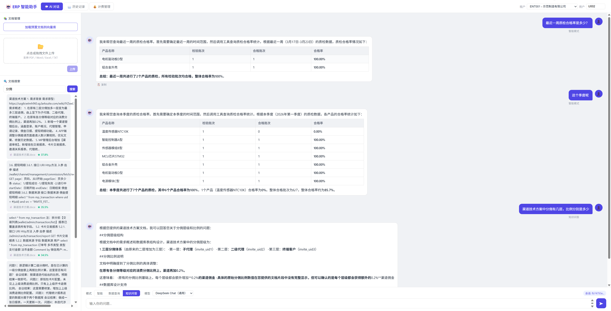
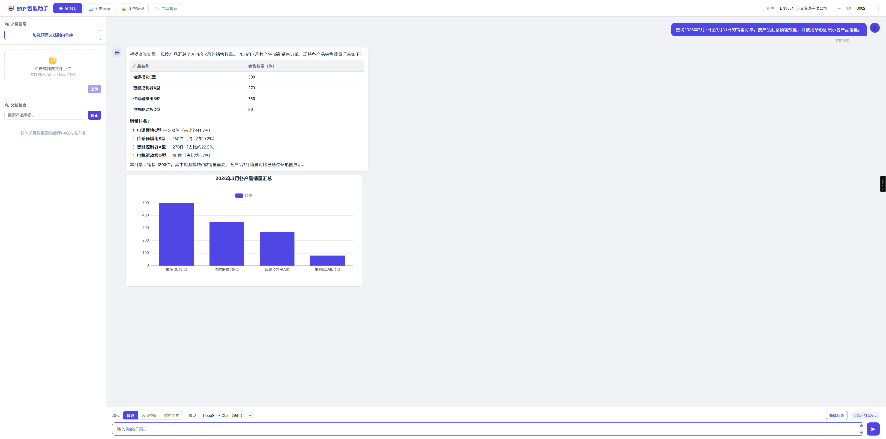
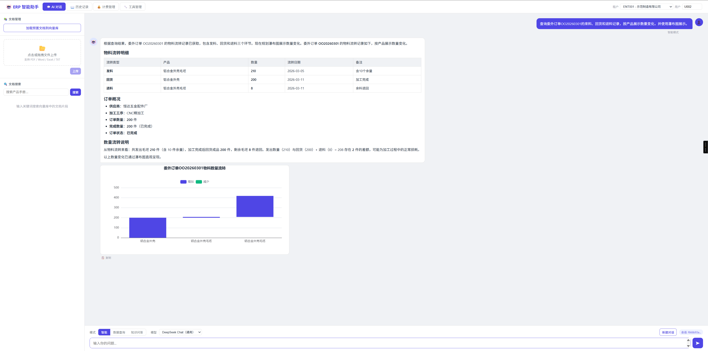
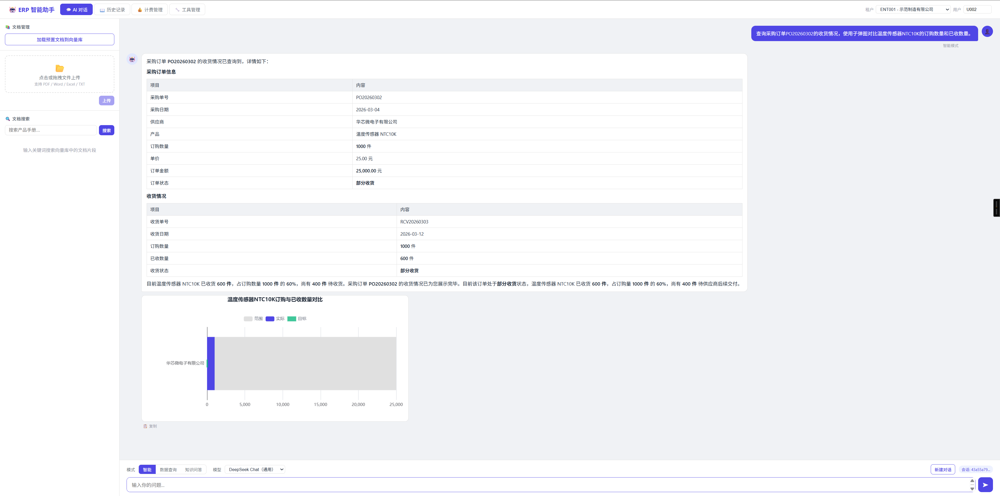
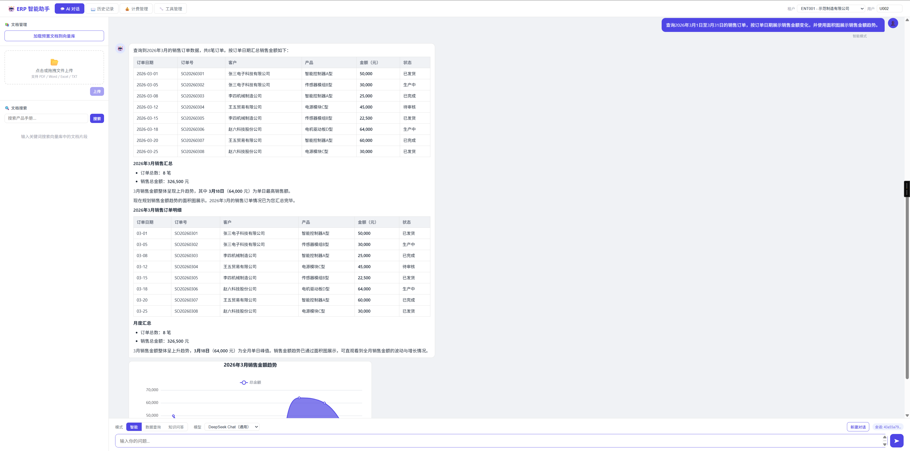
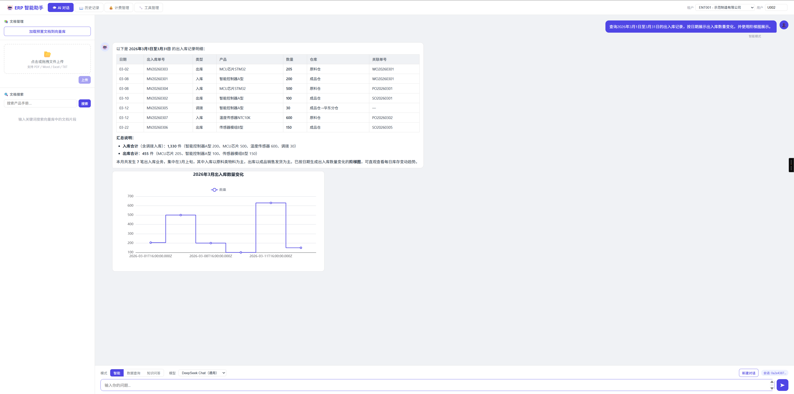
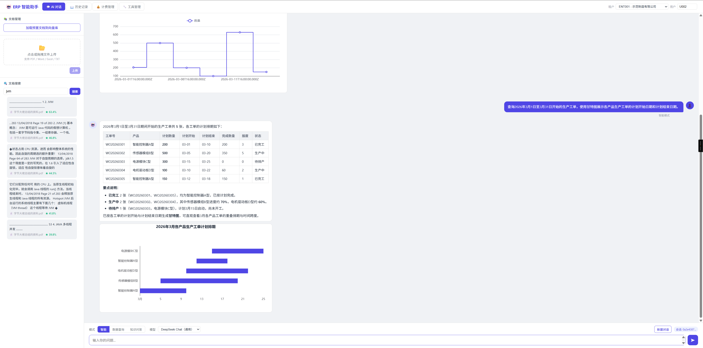

[English](README_EN.md) | 中文

# ERP 智能助手 — Spring AI RAG Demo

基于 Spring AI 构建的制造业 ERP 智能助手，集成了 **Tool Calling**（实时查询业务数据）和 **RAG**（检索用户导入的知识文档）两大 AI 能力，支持多模型切换、流式对话、会话记忆、多租户隔离、计费管理、动态 Tool 管理、Tool 命中追踪和业务数据图表可视化。



## 技术栈

| 层级 | 技术 | 版本 |
|------|------|------|
| 语言 | Java | 17+ |
| 框架 | Spring Boot | 4.0.7 |
| AI 框架 | Spring AI | 2.0.0 |
| 对话模型 | DeepSeek / 通义千问 / Google Gemini | 多模型可切换 |
| 嵌入模型 | all-MiniLM-L6-v2（ONNX 本地推理） | 384 维向量 |
| 向量数据库 | PostgreSQL + PgVector | HNSW 索引 |
| 业务数据库 | MySQL | ERP 业务数据 |
| 数据访问 | Spring JDBC + MyBatis-Plus | 3.5.16 |
| 前端 | 原生 HTML/CSS/JS + marked.js + highlight.js + Apache ECharts | 单页应用 |
| 流式传输 | SSE（Server-Sent Events） | WebFlux Reactor |

### 核心特性

- **Spring AI Tool Calling** — LLM 自动调用 8 大 ERP 模块的代码 `@Tool` 和数据库动态 Tool 查询 MySQL 实时数据
- **Tool 结果图表可视化** — LLM 选择图表类型和标题，后端基于当前轮结构化业务数据生成安全的通用图表协议，前端使用本地 ECharts 渲染
- **Spring AI RAG** — `QuestionAnswerAdvisor` 从 PgVector 检索用户导入的知识文档片段并注入 prompt 上下文
- **多模型切换** — 前端下拉框选择模型，后端通过 `ModelRegistry` 路由到对应 provider 的 `ChatModel`
- **会话记忆** — `MessageChatMemoryAdvisor` + `JdbcChatMemoryRepository` 基于数据库的上下文记忆
- **多租户隔离** — 所有数据查询和向量检索自动按 `ent_code` 隔离
- **流式 Markdown 渲染** — SSE 逐 token 推送 + 前端实时 marked.js 渲染（表格、加粗、列表等）
- **动态 Tool 管理** — 通过前端维护数据库 SQL 查询类 Tool，保存后刷新运行期 Tool 快照
- **Tool 命中追踪** — 记录每次 Tool 调用的租户、会话、模型、入参、状态、耗时和结果规模
- **计费管理** — 按 token 用量计费，支持套餐配额、充值、交易流水

## 启动方式

项目需要两个中间件：PostgreSQL + PgVector 作为向量库，MySQL 作为 ERP 业务库、计费/对话数据、动态 Tool 配置和 Tool 命中流水存储。应用启动时会自动初始化 MySQL 表结构和演示数据，并按业务键跳过已存在数据。

AI 问答至少需要配置一个真实模型 Key。Key 获取地址：
- DeepSeek: https://platform.deepseek.com/api_keys
- 通义千问: https://bailian.console.aliyun.com/cn-beijing?tab=model#/api-key
- Gemini: https://aistudio.google.com/app/apikey

### 方式一：中间件单独启动 + 本地 Maven 启动应用

适合本地开发调试。先启动 PgVector 和 MySQL：

```bash
docker run -d \
  --name pgvector \
  -p 5432:5432 \
  -e POSTGRES_USER=postgres \
  -e POSTGRES_PASSWORD=postgres \
  -e POSTGRES_DB=rag_demo \
  pgvector/pgvector:pg16

docker run -d \
  --name mysql-erp \
  -p 13306:3306 \
  -e MYSQL_ROOT_PASSWORD="你的mysql密码" \
  -e MYSQL_DATABASE=erp \
  -e MYSQL_CHARSET=utf8mb4 \
  mysql:8.0 \
  --character-set-server=utf8mb4 \
  --collation-server=utf8mb4_unicode_ci
```

已创建过容器时直接启动：

```bash
docker start pgvector
docker start mysql-erp
```

配置 AI Key 后启动应用：

```bash
# Linux/macOS/Git Bash
export DEEPSEEK_API_KEY=你的DeepSeekKey
export DASHSCOPE_API_KEY=你的DashScopeKey
export GOOGLE_GENAI_API_KEY=你的GeminiKey

mvn clean spring-boot:run
```

```powershell
# Windows PowerShell
$env:DEEPSEEK_API_KEY="你的DeepSeekKey"
$env:DASHSCOPE_API_KEY="你的DashScopeKey"
$env:GOOGLE_GENAI_API_KEY="你的GeminiKey"

mvn clean spring-boot:run
```

访问 http://localhost:8080 即可使用。

### 方式二：中间件单独启动 + 单独 Docker 启动应用

适合只想用远程应用镜像，但中间件仍由自己管理的场景。先按“方式一”启动 PgVector 和 MySQL，然后启动应用镜像：

```bash
docker pull ly753/spring-ai-rag-demo:latest

docker run -d --name rag-demo \
  -p 8080:8080 \
  -e SPRING_DATASOURCE_PGVECTOR_URL=jdbc:postgresql://host.docker.internal:5432/rag_demo \
  -e SPRING_DATASOURCE_PGVECTOR_USERNAME=postgres \
  -e SPRING_DATASOURCE_PGVECTOR_PASSWORD=postgres \
  -e SPRING_DATASOURCE_ERP_URL=jdbc:mysql://host.docker.internal:13306/erp?useSSL=false\&serverTimezone=Asia/Shanghai\&characterEncoding=utf8\&allowPublicKeyRetrieval=true \
  -e SPRING_DATASOURCE_ERP_USERNAME=root \
  -e SPRING_DATASOURCE_ERP_PASSWORD="你的mysql密码" \
  -e DEEPSEEK_API_KEY=你的DeepSeekKey \
  -e DASHSCOPE_API_KEY=你的DashScopeKey \
  -e GOOGLE_GENAI_API_KEY=你的GeminiKey \
  ly753/spring-ai-rag-demo:latest
```

`host.docker.internal` 用于让应用容器访问宿主机上已映射端口的 PgVector 和 MySQL。Linux 环境如不支持该地址，可以改用 `--network host` 并把数据源地址改回 `localhost`。

### 方式三：docker-compose 一键启动（推荐）

适合直接启动完整运行环境。`docker-compose.yml` 会启动 PgVector、MySQL 和应用容器；应用容器默认使用远程镜像 `ly753/spring-ai-rag-demo:latest`。

不创建 `.env` 时，可以在当前命令行会话中设置环境变量后启动：

```bash
# Linux/macOS/Git Bash
export DEEPSEEK_API_KEY=你的DeepSeekKey
export DASHSCOPE_API_KEY=你的DashScopeKey
export GOOGLE_GENAI_API_KEY=你的GeminiKey
export ERP_DB_PASSWORD="你的mysql密码"

docker compose up -d
```

```powershell
# Windows PowerShell
$env:DEEPSEEK_API_KEY="你的DeepSeekKey"
$env:DASHSCOPE_API_KEY="你的DashScopeKey"
$env:GOOGLE_GENAI_API_KEY="你的GeminiKey"
$env:ERP_DB_PASSWORD="你的mysql密码"

docker compose up -d
```

也可以在项目根目录创建 `.env` 文件固定配置 AI Key：

```properties
# 必需：至少配置一个真实模型 Key
DEEPSEEK_API_KEY=你的DeepSeekKey

# 可选：通义千问
DASHSCOPE_API_KEY=你的DashScopeKey

# 可选：Google Gemini
GOOGLE_GENAI_API_KEY=你的GeminiKey

# 可选：MySQL root 密码，同时会传给应用的 ERP 数据源
ERP_DB_PASSWORD="你的mysql密码"
```

已设置环境变量或 `.env` 后，也可以单独执行启动命令：

```bash
docker compose up -d
```

如果使用旧版 Docker Compose，也可以执行：

```bash
docker-compose up -d
```

查看服务状态和日志：

```bash
docker compose ps
docker compose logs -f app
```

访问 http://localhost:8080 即可使用。

如果首次启动后又修改了 `ERP_DB_PASSWORD`，MySQL 已存在的数据卷仍会保留旧密码；需要先确认数据可删除，再执行 `docker compose down -v` 清理数据卷后重新启动。

### 本地构建当前应用镜像

如需把当前代码打成与 docker-compose 默认镜像同名的本地镜像：

```bash
docker build -t ly753/spring-ai-rag-demo:latest .
```

如需推送到远程仓库：

```bash
docker login
docker push ly753/spring-ai-rag-demo:latest
```

构建入口位于项目根目录，Maven 镜像源配置位于 `deploy/` 目录：

```
Dockerfile             # 多阶段构建：Maven 编译 + JRE 运行
deploy/
└── settings.xml       # Maven 阿里云镜像源加速（解决国内网络问题）
```

## 功能列表

### AI 对话

| 功能 | 说明 |
|------|------|
| 智能模式 | Tool Calling + RAG 同时启用，LLM 自动判断查数据还是查文档 |
| 数据查询模式 | 仅 Tool Calling，适合明确的业务数据查询 |
| 知识问答模式 | 仅 RAG，根据用户导入的知识文档回答问题，不受 ERP 业务范围限制 |
| 流式输出 | SSE 逐 token 推送，实时 Markdown 渲染 |
| 图表展示 | 当前轮 Tool 返回可视化业务数据时，回答正文后最多展示一个图表；同一会话的后续回答仍可继续生成图表 |
| 会话记忆 | 基于数据库的上下文记忆（最近 20 条消息窗口） |
| 多模型切换 | 前端下拉框实时切换 DeepSeek / 通义千问 / Gemini |
| 预置示例问题 | AI 根据 Tool 描述自动生成，页面加载时展示 |
| 消息复制 | 所有消息气泡支持一键复制 |

### Tool 结果图表可视化

当智能模式或数据查询模式命中业务 Tool 且当前轮结果适合可视化时，系统会在 Markdown 业务回答后附加一个图表：

- LLM 只负责选择图表类型和标题，不直接拼装字段绑定、业务数值或 ECharts 配置。
- 后端从当前轮已经捕获的结构化业务数据中自动选择来源、绑定字段、执行受控转换并生成版本化 `ChartSpec`。
- 每个助手回答最多返回一个图表，不限制同一会话内不同轮次生成图表。
- 非流式响应通过可空 `chart` 字段返回图表；流式响应使用 `delta`、`chart`、`done`、`error` 类型化 SSE 事件。
- 图表随助手消息持久化，历史记录和续聊直接回放，不会重新查询业务数据或再次调用 LLM。
- 图表规划、编译或渲染失败时自动降级为 Markdown 文本，不影响原业务回答。
- 前端通过本地 Apache ECharts 及词云、水位图扩展渲染，不依赖 CDN。

系统共支持 23 种图表：环形图、旭日图、条形图、瀑布图、子弹图、面积图、阶梯图、雷达图、散点图、气泡图、直方图、箱线图、热力图、桑基图、矩形树图、甘特图、漏斗图、词云图、仪表盘图、水位图、平行坐标图、折线图和饼图。旭日图、桑基图和矩形树图需要 Tool 返回满足层级或节点关系的数据，其余 20 种可以直接使用下方演示数据测试。

#### 运行效果示例

<table>
  <tr>
    <td align="center"><strong>条形图</strong><br></td>
    <td align="center"><strong>瀑布图</strong><br></td>
  </tr>
  <tr>
    <td align="center"><strong>子弹图</strong><br></td>
    <td align="center"><strong>面积图</strong><br></td>
  </tr>
  <tr>
    <td align="center"><strong>阶梯图</strong><br></td>
    <td align="center"><strong>甘特图</strong><br></td>
  </tr>
</table>

#### 可直接复制的图表测试话术

以下话术基于项目初始化的演示数据编写。请使用“智能”或“数据查询”模式；LLM 会优先遵循话术中明确指定的图表类型。

| 序号 | 图表 | 可直接复制的测试话术 |
|---:|---|---|
| 1 | 环形图 | 查询2026年3月1日至3月31日的售后工单，按处理状态统计工单数量，并使用环形图展示各状态占比。 |
| 2 | 条形图 | 查询2026年3月1日至3月31日的销售订单，按产品汇总销售数量，并使用条形图展示各产品销量。 |
| 3 | 瀑布图 | 查询委外订单OO20260301的来料、回货和退料记录，按产品展示数量变化，并使用瀑布图展示。 |
| 4 | 子弹图 | 查询采购订单PO20260302的收货情况，使用子弹图对比温度传感器NTC10K的订购数量和已收数量。 |
| 5 | 面积图 | 查询2026年3月1日至3月31日的销售订单，按订单日期展示销售金额变化，并使用面积图展示销售金额趋势。 |
| 6 | 阶梯图 | 查询2026年3月1日至3月31日的出入库记录，按日期展示出入库数量变化，并使用阶梯图展示。 |
| 7 | 雷达图 | 查询批次L20260309的质检结果，使用雷达图对比抽样数量、合格数量和不良数量。 |
| 8 | 散点图 | 查询2026年3月1日至3月31日的销售订单，使用散点图分析订单销售数量与销售金额之间的关系。 |
| 9 | 气泡图 | 查询2026年3月1日至3月31日的质检记录，使用气泡图展示合格数量与不良数量的关系，并用抽样数量表示气泡大小。 |
| 10 | 直方图 | 查询2026年3月1日至3月31日的销售订单，使用直方图展示订单销售金额的分布情况。 |
| 11 | 箱线图 | 查询2026年3月1日至3月31日的销售订单，按客户使用箱线图展示订单金额分布。 |
| 12 | 热力图 | 查询2026年3月1日至3月31日的销售订单，使用热力图展示不同客户、不同产品对应的销售数量。 |
| 13 | 甘特图 | 查询2026年3月1日至3月31日开始的生产工单，使用甘特图展示各产品生产工单的计划开始日期和计划结束日期。 |
| 14 | 漏斗图 | 查询2026年3月1日至3月31日的售后工单，按处理状态统计数量，并使用漏斗图展示售后工单处理状态分布。 |
| 15 | 词云图 | 查询2026年3月1日至3月31日的售后工单，按问题类型统计出现次数，并使用词云图展示问题类型频次。 |
| 16 | 仪表盘图 | 查询张三电子科技有限公司的应收账款，使用仪表盘图展示当前未收账款余额。 |
| 17 | 水位图 | 查询2026年3月1日至3月31日的销售汇总，使用水位图展示客户数量。 |
| 18 | 平行坐标图 | 查询2026年3月1日至3月31日开始的生产工单，使用平行坐标图对比各产品工单的计划数量、完成数量和报废数量。 |
| 19 | 折线图 | 查询2026年3月1日至3月31日的收款记录，按收款日期使用折线图展示收款金额变化趋势。 |
| 20 | 饼图 | 查询2026年3月1日至3月31日的销售订单，按产品汇总销售数量，并使用饼图展示各产品销量占比。 |

### ERP Tool Calling（代码 Tool + 动态数据库 Tool）

系统会把现有 `com.example.rag.tool` 下的代码 `@Tool` 与启用状态的数据库动态 Tool 合并成同一份 Spring AI Tool 快照。auto/data 模式可调用 Tool；knowledge 模式只使用 RAG，不暴露 Tool。

#### 代码 ERP Tool（8 大模块，39 个工具方法）

| 模块 | 工具数 | 支持的查询 |
|------|--------|-----------|
| 销售 | 6 | 订单列表/详情/发货/应收/汇总 + 按时间查询 |
| 采购 | 5 | 订单列表/详情/收货/应付 + 按时间查询 |
| 生产 | 5 | 工单状态/列表/用料/工序 + 按时间查询 |
| 质检 | 5 | 质检结果/列表/不良明细/合格率 + 按时间查询 |
| 仓库 | 5 | 库存/仓库明细/出入库/预警 + 按时间查询 |
| 财务 | 5 | 应收账龄/应付账龄/月度汇总/收款/收支明细 |
| 售后 | 4 | 工单列表/详情/退换货 + 按时间查询 |
| 委外 | 4 | 订单列表/详情/来料退料 + 按时间查询 |

所有工具方法支持自然语言时间表达（"最近一周"、"本月"、"今年"等），LLM 自动转换为日期范围。

#### 动态 LLM Tool 管理

| 功能 | 说明 |
|------|------|
| 数据库定义 | `a_llm_tool` 全局维护 Tool 名称、描述、入参 JSON Schema、SQL 模板、主表别名、返回行数和状态 |
| 前端管理 | 顶部「工具管理」页面支持新增、编辑、删除、启停、刷新加载和 Tool 命中流水查看 |
| 运行期刷新 | Tool 配置保存、删除或启停后刷新 `ToolSnapshot`，后续 LLM 问答使用最新 Tool |
| 租户隔离 | 动态 Tool 定义全局共享，但执行时强制读取当前 `ent_code` 并注入 SQL 查询条件 |
| SQL 安全 | 首期只允许单层只读 `SELECT`，使用绑定变量，拒绝写入、DDL、多语句、复杂查询块和非法主表别名 |
| 命中流水 | `a_tool_call_log` 记录 Tool 来源、入参、状态、耗时、结果数、错误摘要和助手消息关联 |
| 前端展示 | 状态和来源展示中文文案，前后端传输仍保持 `active`/`inactive`、`code`/`database` 英文枚举 |
| Schema 辅助 | 入参 Schema 编辑区提供 JSON Schema 说明、参数命名约束和可编辑示例数据 |
| 初始化示例 | 默认演示数据包含 `query_dynamic_sales_orders` 和 `query_inventory_lot_location` |

### 文档管理

- 一键加载 `classpath:docs/` 预置文档
- 上传 PDF / Word / Excel / TXT（Apache Tika 解析）
- 文档搜索（向量相似度检索，调试用）

### 计费管理

- 账户余额 / 套餐配额
- 交易流水（充值/扣费/赠送）
- 每日 / 月度 token 用量统计
- 在线充值

### 对话历史

- 会话列表（分页，按时间倒序）
- 消息详情（含 token 用量、耗时等元数据）
- 会话删除（软删除）

## 多模型配置

项目支持同时接入多个模型服务商，前端可自由切换。配置分三步：

### 第一步：添加 Maven 依赖

每个服务商对应一个 Spring AI starter：

```xml
<!-- DeepSeek（已内置） -->
<dependency>
    <groupId>org.springframework.ai</groupId>
    <artifactId>spring-ai-starter-model-deepseek</artifactId>
</dependency>

<!-- 通义千问（复用 OpenAI 兼容协议） -->
<dependency>
    <groupId>org.springframework.ai</groupId>
    <artifactId>spring-ai-starter-model-openai</artifactId>
</dependency>

<!-- Google Gemini -->
<dependency>
    <groupId>org.springframework.ai</groupId>
    <artifactId>spring-ai-starter-model-google-genai</artifactId>
</dependency>
```

### 第二步：配置 application.yml

```yaml
app:
  models:
    - id: deepseek-chat         # 唯一标识，前端传参用
      label: DeepSeek Chat（通用） # 下拉框显示名
      provider: deepseek         # 服务商标识
      model-name: deepseek-chat  # 实际传给 API 的模型名
      default: true              # 默认选中
    - id: qwen-max
      label: 通义千问 Max
      provider: openai           # 通义千问走 OpenAI 兼容协议
      model-name: qwen-max

spring:
  ai:
    deepseek:
      api-key: ${DEEPSEEK_API_KEY}
    openai:
      api-key: ${DASHSCOPE_API_KEY}
      base-url: https://dashscope.aliyuncs.com/compatible-mode  # 不要加 /v1
    google:
      genai:
        api-key: ${GOOGLE_GENAI_API_KEY}
```

### 第三步：注册 provider（仅新服务商需要）

`ModelRegistry.PROVIDER_BEAN_NAMES` 已内置当前启用 provider，以及 Spring AI 2.0.0 正式版已确认适配的 `anthropic`、`ollama`、`mistral`、`bedrock` 映射。只有新增的服务商仍不在已有映射中时，才需要追加：

```java
private static final Map<String, String> PROVIDER_BEAN_NAMES = Map.ofEntries(
    Map.entry("deepseek",     "deepSeekChatModel"),
    Map.entry("openai",       "openAiChatModel"),
    Map.entry("google-genai", "googleGenAiChatModel"),
    // 示例: Map.entry("custom-provider", "customProviderChatModel")
);
```

Bean 名称来自各 Spring AI starter 的 AutoConfiguration 类。`azure-openai`、`vertex-ai-gemini`、`minimax`、`zhipu`、`huggingface`、`oci-genai` 等历史 provider 在 Spring AI 2.0.0 正式版中未确认适配，后续启用前需先核对 starter 坐标和 ChatModel bean 名称。

## 项目结构

```
com.example.rag
├── RagDemoApplication              # 启动类
├── chat/                           # AI 对话核心
│   ├── ErpAssistantService         # LLM 问答编排 + Tool Calling + RAG
│   ├── DocumentLoaderService       # 文档导入向量库
│   ├── ModelRegistry               # 多模型注册中心
│   ├── client/                     # Provider 路由、ChatClient 缓存和 Tool 装配
│   ├── lifecycle/                  # 消息、计费、Tool 流水和回答终止收口
│   ├── dto/                        # 对话内部 DTO / record
│   ├── output/                     # 助手回答净化与内部旁白过滤
│   └── chart/                      # Tool 结果图表可视化
│       ├── capture/                # 当前轮结构化业务 Tool 结果捕获
│       ├── compile/                # 字段绑定、转换、规划和可信图表编译
│       ├── model/                  # 图表内部模型
│       ├── protocol/               # ChartSpec 编解码与协议校验
│       ├── selection/              # LLM 图表类型和标题选择
│       └── tool/                   # 内部图表选择 Tool
├── controller/                     # HTTP Controller 入口
│   ├── ChatController              # 问答/文档/模型列表/hints
│   ├── ConversationController      # 历史记录 API
│   ├── BillingController / BillingManagementController
│   ├── TenantManagementController
│   └── ToolManagementController    # 动态 Tool 管理和命中流水 API
├── conversation/                   # 对话历史
│   ├── ChatHistoryService          # 会话/消息 CRUD
│   └── JdbcChatMemoryRepository    # Spring AI ChatMemory 的 JDBC 实现
├── billing/                        # 计费
│   ├── BillingManagementService
│   └── BillingService
├── tool/                           # ERP Tool Calling（8 个模块）
│   ├── BaseTool                    # 租户隔离基类（自动注入 ent_code）
│   ├── SalesTool / PurchaseTool / ProductionTool / QualityTool
│   ├── WarehouseTool / FinanceTool / AfterSalesTool / OutsourcingTool
│   ├── admin/                      # 动态 Tool 管理服务
│   ├── dynamic/                    # 数据库 Tool SQL 校验、绑定、租户注入和执行
│   ├── registry/                   # Tool 快照注册和刷新
│   └── trace/                      # Tool 命中流水和本轮调用聚合
├── dao/                            # MyBatis-Plus Entity / Mapper
│   ├── entity/                     # 会话、计费、租户、Tool 定义和调用日志实体
│   └── mapper/                     # ERP MySQL 数据访问 Mapper
├── init/                           # MySQL 表结构和演示数据初始化
├── config/                         # 配置
│   ├── ModelProperties             # 多模型 YAML 配置绑定
│   ├── ChatModelConfig             # @Primary ChatModel 声明
│   ├── DataSourceConfig            # 双数据源（PgVector + MySQL）
│   ├── TenantFilter / TenantContext / TenantContextAccessor
│   ├── ContextPropagationConfig    # Reactor 上下文传播
│   └── GlobalExceptionHandler
└── vo/                             # 请求/响应对象
    ├── ChatVO / ConversationVO / BillingVO / AdminVO / RespVO
    └── ChartVO                     # 前后端通用版本化图表协议
```

## License

该项目已获得许可 [Apache License 2.0](LICENSE).