## Context

项目当前通过 `ErpAssistantService` 统一编排 auto/data/knowledge 三种问答模式。auto/data 模式使用 `ToolRegistryService` 提供的代码 Tool 与动态数据库 Tool；`LoggingToolCallback` 能在 Tool 执行后取得字符串结果，但目前只记录结果条数，没有保留原始行。非流式接口只返回回答文本，流式接口返回纯文本 `Flux<String>`，`a_chat_message` 也只保存 Markdown 和 Tool 摘要。

本变更需要在不改变业务 Tool SQL、租户隔离和计费主流程的前提下增加以下链路：

```mermaid
flowchart LR
    U["用户问题"] --> C["ChatController"]
    C --> A["ErpAssistantService"]
    A --> CP["AssistantClientProvider"]
    CP --> L["当前 Provider ChatModel"]
    L --> B["业务 Tool"]
    B --> W["LoggingToolCallback"]
    W --> R["ToolResultRecorder<br/>按 traceId 暂存真实结果"]
	R --> P["内部图表选择 Tool<br/>LLM 只选择类型和标题"]
	P --> F["ChartPlanFactory<br/>自动选择来源、绑定与转换"]
	F --> V["ChartCompiler<br/>校验并生成 ChartSpec"]
    V --> G["ToolResultRecorder<br/>保存首个有效图表"]
    L --> X["文本与 usage"]
    X --> A
    A --> LS["AssistantLifecycleService"]
    G --> LS
    LS --> O["AssistantAnswerSanitizer<br/>隔离内部旁白与最终答案"]
    O --> S["文本、图表、持久化与计费收口"]
    S --> N["非流式 AskResponse"]
    S --> E["类型化 SSE"]
    S --> D["a_chat_message.chart_spec"]
    D --> H["历史详情与续聊回放"]
```



主要约束：

- 单模块 Spring Boot 4.0.7 / Spring AI 2.0.0，Java 17。
- 三个 LLM Provider 必须继续经 `ModelRegistry` 路由。
- 所有原始 Tool 结果已经经过现有租户隔离；图表链路不得重新查询 ERP 数据或绕过 `TenantContext`。
- 正常路径的图表规划复用本轮 Tool Calling 循环；只有本轮业务 Tool 漏调用或已有结果但漏规划时允许一次有界重试或结构化选择，并将全部 Token 合并结算。
- 前端继续采用静态 HTML/CSS/JavaScript，无 npm、打包器或 CDN。
- 项目为前后端一体部署，`/api/ask/stream` 由同仓前端直接消费，可统一升级为单一类型化 SSE。
- 图表属于助手消息的一部分，需要支持刷新页面后的历史回放。

## Goals / Non-Goals

**Goals:**

- 业务 Tool 返回成功且数据适合可视化时，让 LLM 选择一个语义合理的图表。
- LLM 只决定图表类型和标题；来源、字段映射、转换、安全选项及最终数值全部由后端从真实 Tool 结果生成。
- 定义与渲染库解耦的版本化 `ChartSpec`，覆盖已确认的 23 种图表。
- 同一轮问答最多返回一个图表，不同轮次可以分别拥有图表。
- 同时支持非流式响应、类型化 SSE 实时响应、历史详情和续聊回放。
- 图表子流程失败时安全降级为原有 Markdown 回答。
- 不改变业务 Tool 命中统计、计费、租户隔离和动态 Tool 管理语义。

**Non-Goals:**

- 不提供用户手动编辑图表、切换图表类型或保存独立仪表板的能力。
- 不允许前端或 LLM 传入任意 ECharts option、JavaScript formatter、HTML、URL 或 CSS。
- 不对知识库 RAG 片段生成图表。
- 不重新查询业务数据库来补充图表字段，不改变现有代码 Tool 或动态 Tool SQL。
- 不在首版提供跨会话图表聚合、实时刷新、钻取查询、图片导出或图表配置管理页面。
- 不保证每个非空 Tool 结果都能形成有意义图表；无法通过适用性校验时只展示文本。

## Decisions

### 1. 使用“业务结果记录器 + 内部图表规划 Tool + 后端编译器”

新增 `com.example.rag.chat.chart` 能力，并按职责继续拆分子包：

| 子包 | 组件 | 职责 |
|---|---|---|
| `chart.model` | `ChartPlan`、`BusinessToolResult`、`TraceChartContext` | 图表域内部不可变 record |
| `chart.capture` | `ToolResultRecorder` | 按 `traceId` 暂存本轮成功业务 Tool 结果、首个有效图表并负责清理 |
| `chart.compile` | `ChartPlanFactory`、`ChartPlanValidator`、`ChartCompiler` | 从真实行自动生成内部规划、执行完整校验并编译最终 `ChartSpec` |
| `chart.protocol` | `ChartSpecCodec` | JSON 编解码、协议版本、大小、语义通道类型和日期格式校验 |
| `chart.tool` | `ChartPlanToolCallback` | 暴露内部规划 Tool Schema 并触发后端编译 |

为避免图表能力继续扩大 `ErpAssistantService`，chat 编排额外拆分为：

| 子包 | 组件 | 职责 |
|---|---|---|
| `chat.client` | `AssistantClientProvider` | 多 Provider 路由、系统提示词、业务 Tool 与内部规划 Tool 装配、Client 缓存 |
| `chat.lifecycle` | `AssistantLifecycleService` | 会话准备、消息持久化、计费、Tool 流水、图表降级和流式成功/异常/取消收口 |
| `chat.dto` | `ChatAnswerResult`、`ChatStreamFrame`、`DocSnippet`、`SavedAssistantMessage` | chat 域内部不可变传输对象 |
| `chat.output` | `AssistantAnswerSanitizer` | 通过最终答案边界隔离 Tool Calling 中间旁白，并兼容净化旧历史消息 |

Spring Bean 依赖必须保持单向：
`ErpAssistantService → AssistantClientProvider / AssistantLifecycleService → 既有领域 Service 与图表组件`。
图表编译、记录和 Tool 组件不得反向依赖 `ErpAssistantService`，并通过构造器依赖图测试防止循环依赖。

`LoggingToolCallback.call()` 在原 delegate 成功返回之后执行两项互不阻塞的动作：

1. 保持现有 `ToolCallRecorder` 与 `a_tool_call_log` 行为；
2. 当 `toolType` 为 `code` 或 `database` 时，将结果交给 `ToolResultRecorder.capture()`。

捕获失败只记录 WARN，不改变返回给 LLM 的原结果。

`ChartPlanToolCallback` 由 `AssistantClientProvider.resolveClient()` 在业务 Tool 快照之外追加，因此：

- 动态 Tool 刷新不会删除内部规划能力；
- `plan_chart_visualization` 作为系统保留名称，动态 Tool 配置必须拒绝占用，最终装配时还需校验业务 Tool 与内部 Tool 的名称唯一性；
- 它不出现在 `ToolRegistryService` 的业务快照、管理 API 或 `a_llm_tool`；
- 它不写入 `a_tool_call_log`、`tool_calls` 或 `tool_calls_count`；
- knowledge 模式使用无 Tool 的 Client，不会看到该能力。

系统提示词增加通用规则：

- 用户当前问题包含中文时必须全程使用中文回答，不得混入英文开场、过程说明或结束语；
- 最终回答不得出现 Tool 名称、函数名称、数据库表名、字段名、SQL 或内部调用过程；
- 业务查询、图表规划和重试阶段不得输出过程旁白，全部 Tool 调用结束后使用内部 `<!--FINAL_ANSWER-->` 标记声明最终答案起点；
- 动态数据库 Tool 与代码 Tool 能力重叠时只调用动态 Tool，成功后不得重复调用代码 Tool；
- 业务 Tool 成功返回非空且适合图表时，在最终文本前调用一次图表选择 Tool；
- 两行及以上且包含数值字段，或可按状态、类型等分类计数的业务结果必须判定为适合可视化，即使文本已经使用 Markdown 表格也不能省略图表规划；
- 图表规划必须在相关业务 Tool 已返回后单独调用，不能与数据查询 Tool 放在同一个并行调用批次；
- 模型只填写图表类型和业务标题，不填写来源、字段、转换、选项或数值；
- 后端按标题相关性、结构兼容性和调用顺序选择一份来源结果，并自动生成字段绑定、转换和安全选项；
- 单条不可比较文本、空结果和错误结果不调用规划 Tool。

内部图表选择 Tool 的描述按“用途、调用条件、填写规则、图表选择”分段，并使用编号和分类列表明确调用顺序、`type/title` 两字段约束、后端自动规划职责以及 23 种图表的选择原则，避免连续文本降低模型和开发人员的可读性。

`AssistantAnswerSanitizer` 在非流式响应保存前移除内部边界及其之前的文本；流式响应按请求创建独立状态，优先识别允许跨网络分片的最终答案标记。Provider 未输出标记时，只暂存能够匹配中文或英文内部执行前缀的有界开头；一旦开头不再可能是旁白，或已经安全剥离旁白并定位到业务正文，立即释放已确认正文并透传后续分片。兼容净化只依据明确执行句式或规划拒绝协议标记，不把 `bindings`、`transform`、“重新尝试”或“图表规划”等可能出现在合法技术说明和业务建议中的单个词作为删除依据。仅始终无法判定的内容保留到完成阶段执行兼容净化，不再把所有无标记回答无条件缓存到 `finish()`。历史读取对旧助手消息执行同一兼容净化，不修改用户消息和数据库原始记录。
取消或异常若发生在最终答案标记中间，尚未发送的合法标记前缀必须作为内部协议片段丢弃，不得补发给前端或写入取消、失败消息。
内部旁白与标记前缀分属不同段落时，流式净化仍须按文本末尾的标记真前缀继续暂存；终止时先删除末尾残缺标记，再净化剩余旁白，避免内部协议片段进入正文或消息持久化。

**备选方案：让 LLM 在 Markdown 中输出隐藏 JSON。** 流式过程中难以可靠剥离，JSON 容易泄漏到正文，且可能被 Markdown 或模型格式偏差破坏，因此不采用。

**有界兜底：回答结束后由当前模型补选图表类型和标题。** 运行反馈证明长会话中模型可能复用历史 Markdown 数据并跳过业务 Tool 或规划 Tool。当前轮已有结构化业务数据但没有图表时，后端使用无业务 Tool 的专用 Client 只生成 `type/title`，再调用既有后端规划与编译链路。该调用最多一次，Token 合并到本轮消息与计费，不把选择文本返回用户。

补选 Client 使用零随机度并要求返回唯一 `type/title` JSON 对象。为兼容 Provider 偶发增加 Markdown 代码围栏，服务端从回答中提取唯一 JSON 对象后再次校验顶层字段必须恰好为 `type/title`，再交给既有图表规划 Tool；解释文本、多个对象、Schema 外字段或超限内容继续拒绝。主回答不得宣称图表已经生成或展示，是否存在图表只以最终 `ChartSpec` 为准。

**备选方案：前端解析 Markdown 表格自动选图。** 无法满足“类型由 LLM 选择”，也会丢失已捕获结构化数据的数据类型、层级和关系语义，因此不采用。

### 2. 原始 Tool 结果只做短生命周期内存暂存

`ToolResultRecorder` 使用 `ConcurrentHashMap<String, TraceChartContext>`，其中 `TraceChartContext` 持有：

- `traceId`
- `entCode`
- `conversationId`
- 按调用完成顺序排列的 `BusinessToolResult`
- 最多一个已接受 `ChartSpec`
- 创建时间

`BusinessToolResult` 至少包含：

- `sequence`
- `toolName`
- `toolType`，仅允许 `code`、`database`
- `rows`
- `capturedAt`

结果解析规则：

- JSON 数组：每个对象元素作为一行；
- 包含 `rows` 数组的 JSON 对象：使用 `rows`；
- 单个 JSON 对象：作为一行；
- 标量、非 JSON 文本或嵌套深度超限：标记为不可图表化，但不影响 Tool 回答。

资源上限：

- 单个业务 Tool 原始 JSON 在解析前最多 256 KiB；
- 原始 JSON 只执行一次有界解析，安全数据行与明确空结果状态由同一次解析返回；超过字节预算后不得为判断空结果再次解析；
- 每个业务 Tool 最多保留 50 行；
- 每轮最多保留 8 次业务 Tool 结果；
- 单个对象最多 64 个字段，单个集合最多 200 个元素，单次结果最多 5000 个结构节点；
- 单个字符串单元格最多 500 个字符；
- 解析嵌套深度最多 8；
- 最终 `ChartSpec` 最多 50 行、32 个维度、JSON UTF-8 大小最多 60 KiB；
- 超限数据只供原有 LLM 回答使用，不进入图表编译。

所有读取必须同时匹配 `traceId` 与 `ToolContext` 中的 `entCode`、`conversationId`。正常完成、异常、取消均在 `finally/doFinally` 清理；另增加保守的过期清理，防止进程异常路径造成长期滞留。原始 Tool 结果不写入日志、`a_tool_call_log` 或 `a_chat_message`。

**理由：** Tool 返回值已在本轮内存中提供给 LLM，短暂保存解析结构不会新增数据源访问；不持久化原始结果可以降低敏感业务数据重复存储和跨租户泄漏面。

### 3. LLM 只选择图表类型和标题，完整 ChartPlan 由后端生成

图表选择 Tool 输入采用只有两个业务字段的显式 JSON Schema，逻辑结构如下：

```json
{
  "type": "bar",
  "title": "最近一年各产品销售数量对比"
}
```

模型输入约束：

- `type`：使用统一 `ChartVO.ChartType` 枚举，取值为 23 个固定协议编码之一；
- `title`：1～120 个字符的安全纯文本；
- 模型不得提交来源 Tool、调用顺序、字段名、语义通道、转换、单位、展示选项或业务数值；
- 选择 JSON 原始 UTF-8 数据最多 2 KiB，嵌套深度最多 4 层，单个容器最多 2 个元素，结构节点总量最多 8；
- 服务端只允许 `type/title` 两个顶层字段，同一输入只解析一次。

`ChartPlanFactory` 根据本轮全部 `BusinessToolResult` 自动完成：

1. 只分析所有数据行共同存在的安全标量字段，并区分数值、非负数值、日期和文本字段；数值型订单号、工单号、编码等业务标识只可作为类别或计数来源，不得绑定为数值指标；
2. 结合标题中的数量、金额、余额、比例、日期、产品、客户、供应商、状态和账龄等业务语义，对字段及来源结果排序；标题直接包含自定义字段名，或命中地区、部门、渠道、品牌等常用别名时，可用于识别系列维度；
3. 根据 23 种图表的固定语义通道生成来源 Tool、精确调用顺序和字段绑定；
4. 对重复类别或时间轴自动生成受控 `aggregate` 转换，标题明确要求按产品、客户等维度对比时自动绑定可选 `series` 并按横轴与系列联合分组；普通数量和金额使用 `sum`，比例和平均值字段使用 `avg`；当分类结果没有数值列时，使用每行均非空的业务标识字段执行 `count`，计数只来源于当前结构化结果，不采信 LLM 回答中的推导数字；
5. 从标题中的 `TOP N` 或“前 N”生成 1～50 的安全行数限制，并为排序、方向、标签、阶梯方式、仪表盘和水位图范围生成白名单选项；
6. 每个候选仍必须经过原 `ChartPlanValidator`、`ChartCompiler` 和 `ChartSpecCodec` 完整校验，当前来源失败时继续尝试其他已捕获结果；
7. 只有所有候选都无法满足 LLM 所选类型时，才将图表降级为空并保留文本回答。

内部 `ChartPlan` record 继续作为后端编译协议使用，但不再由 Provider 直接反序列化生成。每个内部规划只选择一个真实来源结果，不合并不同 Tool 数据。

`ChartPlanToolCallback` 返回给 LLM 的结果仅为：

```json
{"accepted":true,"chartId":"<uuid>"}
```

或：

```json
{"accepted":false,"retryable":false,"reason":"本轮业务数据无法满足所选图表类型"}
```

错误原因使用稳定、非敏感摘要，不返回 SQL、租户、字段名、原始行或堆栈，也不再要求模型拼接或纠正完整规划。

### 4. ChartSpec 采用数据集、语义通道和安全选项三层结构

对外 VO 放在 `com.example.rag.vo.ChartVO`，使用嵌套 record：

```java
ChartVO.ChartSpec(
    String schemaVersion,
    String chartId,
    ChartVO.ChartType type,
    String title,
    String subtitle,
    ChartVO.Dataset dataset,
    Map<String, List<String>> encoding,
    ChartVO.ChartOptions options,
    ChartVO.ChartSource source
)
```

数据子结构：

```java
ChartVO.Dataset(
    List<ChartVO.Dimension> dimensions,
    List<Map<String, Object>> rows
)

ChartVO.Dimension(
    String key,
    String label,
    String dataType,
    String unit
)

ChartVO.ChartOptions(
    String orientation,
    Boolean stacked,
    Boolean smooth,
    String step,
    Integer binCount,
    Double min,
    Double max,
    String unit,
    String sort,
    Boolean showLabel
)

ChartVO.ChartSource(
    List<String> toolNames
)
```

约束：

- `schemaVersion` 首版固定为 `"1.0"`；
- `ChartPlan.type`、`ChartSpec.type`、校验映射和编译分支统一使用 `ChartVO.ChartType`；
- `ChartType` 通过 Fastjson 和 Jackson 固定序列化为现有小写连字符协议编码，并可反序列化历史 `chart_spec` 与 LLM Tool JSON 中的相同字符串；
- LLM Tool Schema 的 `type` 枚举值从 `ChartType` 生成，避免后端类型清单漂移；
- `dataType` 仅允许 `string`、`number`、`date`、`datetime`、`boolean`；
- `encoding` 的 key 与字段数量按图表类型白名单校验；
- `rows` 只包含编译后需要展示的字段；
- `ChartSpecCodec` 在编码和历史解码时都按图表类型校验必需/可选通道、通道字段数量、维度引用、行字段、空值和值类型，并复用统一 options 白名单；数值语义通道必须引用 `number` 维度，甘特图起止通道必须引用 `date` 或 `datetime` 维度且字符串可按 ISO-8601 解析；雷达指标与上界必须一一对应且上界有效；非法历史图表降级为空图表；
- `source` 只暴露 Tool 名称，不暴露 SQL、参数、`entCode` 或内部调用 ID；
- `ChartSpec` 不允许包含函数、HTML、URL、正则、CSS 或原始 ECharts option。

示例：

```json
{
  "schemaVersion": "1.0",
  "chartId": "debf7140-e434-43ec-9679-f6adea4c7600",
  "type": "bar",
  "title": "各产品销售金额",
  "subtitle": null,
  "dataset": {
    "dimensions": [
      {"key": "product", "label": "产品", "dataType": "string", "unit": null},
      {"key": "amount", "label": "销售额", "dataType": "number", "unit": "元"}
    ],
    "rows": [
      {"product": "产品A", "amount": 128000.00},
      {"product": "产品B", "amount": 96000.00}
    ]
  },
  "encoding": {
    "category": ["product"],
    "value": ["amount"]
  },
  "options": {
    "orientation": "vertical",
    "stacked": false,
    "smooth": false,
    "step": null,
    "binCount": null,
    "min": null,
    "max": null,
    "unit": "元",
    "sort": "desc",
    "showLabel": true
  },
  "source": {
    "toolNames": ["getSalesSummary"]
  }
}
```

**理由：** ECharts 的 dataset/encode 思路适合表格型图表，但旭日图、矩形树图和桑基图等需要特殊 `series.data`。因此对外协议保留统一的扁平 rows + 语义通道，由前端适配器选择 dataset 或构造 nodes/links/tree，避免协议直接耦合某一渲染库。

### 5. 为 23 种图表定义固定通道和后端转换

| `type` | 必需 encoding | 后端处理 | 前端实现 |
|---|---|---|---|
| `pie` | `name`, `value` | 类别聚合 | pie |
| `donut` | `name`, `value` | 类别聚合 | pie + 固定内外半径 |
| `sunburst` | `id`, `parentId`, `name`, `value` | 构树、环检测 | sunburst `series.data` |
| `bar` | `category`, `value`，可选 `series` | 聚合、排序 | bar；orientation 控制横纵 |
| `waterfall` | `category`, `value` | 计算累计基线、增减值 | 堆叠 bar，基线透明 |
| `bullet` | `category`, `actual`, `target`，可选 `range` | 校验目标与区间 | 重叠 bar + markLine |
| `area` | `x`, `y`，可选 `series` | 时间/类别排序 | line + areaStyle |
| `step` | `x`, `y`，可选 `series` | 时间/类别排序 | line + step |
| `line` | `x`, `y`，可选 `series` | 时间/类别排序 | line |
| `radar` | `name`, `indicator` | 指标归一与上界计算 | radar |
| `scatter` | `x`, `y`，可选 `series` | 数值校验 | scatter |
| `bubble` | `x`, `y`, `size`，可选 `series` | 非负大小、视觉范围归一 | scatter + symbolSize |
| `histogram` | `value` | 默认 Sturges 分箱，`binCount` 限 5～20 | bar |
| `boxplot` | `category`, `value` | 计算 min/Q1/median/Q3/max 与 1.5 IQR 异常值 | boxplot + scatter |
| `heatmap` | `x`, `y`, `value` | 类别或数值坐标组合与数值范围 | heatmap + visualMap |
| `sankey` | `source`, `target`, `value` | 节点去重、边校验、有向环检测 | sankey nodes/links |
| `treemap` | `id`, `parentId`, `name`, `value` | 构树、环检测 | treemap `series.data` |
| `gantt` | `category`, `start`, `end`，可选 `progress` | 时间解析、起止校验 | custom/range bar |
| `funnel` | `name`, `value` | 非负校验、排序 | funnel |
| `word-cloud` | `name`, `value` | 非负权重、数量限制 | 官方 custom word cloud |
| `gauge` | `name`, `value` | 单指标、min/max 与范围校验 | gauge |
| `liquid-fill` | `name`, `value` | 按 min/max 归一到 0～1 | 官方 custom liquid fill |
| `parallel` | `name`, `parallel`（至少 3 个字段） | 多数值维度校验 | parallel |

后端是统计结果的唯一权威方：

- 直方图分箱、箱线图五数、瀑布累计基线由 `ChartCompiler` 计算；
- `transform.sortBy` 必须引用编译后仍存在的绑定字段；直方图按分箱顺序展示，不接受
  自定义排序，箱线图只接受类别绑定字段排序，避免排序字段在投影或统计转换后被静默丢弃；
- 常量直方图必须围绕唯一值生成递增的有效分箱边界，所有分箱起点不得大于或等于终点；
- `aggregate` 转换的分组字段必须使用 `none`，非分组绑定字段必须显式声明聚合方式；其他转换不得携带会被忽略的聚合声明；
- `groupBy` 仅允许在 `aggregate` 转换中使用，字段必须去重且只能引用已经绑定的来源字段；聚合结果在返回前再次按绑定字段投影；
- 除 `count` 可统计字符串等非空业务标识外，所有数值通道的来源行都必须提供非空数值；前端不得把历史空值转换为零；
- 除雷达图 `indicator` 和平行坐标图 `parallel` 外，每个语义通道最多绑定一个字段；
- 后端生成的 `sourceCallIndexes` 必须精确指向当前候选结果，且 Tool 名称与完成顺序必须完全一致；
- 桑基图必须在后端通过拓扑检测拒绝自环和多节点有向环，避免 ECharts DAG 布局失败；
- 雷达图指标必须为非负数，水位图经过排序和 limit 后必须只包含一个业务指标；
- 仪表盘未显式配置上下界时，后端与前端统一使用 `0` 到 `100`，越界值和编译后多指标数据必须拒绝；
- 子弹图的 actual、target、可选 range 和统一展示单位必须保持一致；
- LLM 只能选择图表类型和标题，字段与算法参数由后端固定规则生成；
- `transform.type` 必须同时通过图表类型兼容白名单：通用图表只接受
  `identity`/`aggregate`，直方图、箱线图、瀑布图和层级图只额外接受各自专用转换，
  不执行转换的气泡图、甘特图和水位图只接受 `identity`；
- 日期兼容 ISO-8601 与 ERP MySQL `yyyy-MM-dd HH:mm:ss[.fraction]`，编译后统一输出 ISO-8601 字符串；
- 日期形字符串仅在甘特图 `start`/`end` 通道按日期校验和推断类型；非时间通道的字符串统一保持 `string`，同一类目字段可同时包含日期形文本与普通文本；
- 自动规划仅在标题语义明确命中且系列字段具有 2～12 个可比较值时绑定 `series`；聚合转换按横轴或类别与系列联合分组，避免把不同业务系列合并求和；
- 甘特图自动识别 `progress`、`进度`、`完成率` 等 0～1 数值字段并绑定可选进度通道，其他百分比表达不在规划阶段静默换算；
- `BigDecimal` 保持 JSON 数值精度，不先转 `double`；只有 ECharts 需要的范围计算使用受控 `double`；
- 气泡图、水位图和雷达图的派生字段优先保持既有协议键；与业务绑定字段冲突时使用唯一内部键，并通过 `encoding` 引用，禁止覆盖真实业务字段；
- 业务 Tool 结果没有后端可信的字段语义和单位元数据，首版每个图表规划只能选择一个来源结果，多来源规划直接拒绝。

### 6. 采用 Apache ECharts 6、官方扩展与本地甘特渲染函数

静态资源新增：

- `static/vendor/echarts.min.js`
- `static/vendor/echarts-custom-word-cloud.auto.js`
- `static/vendor/echarts-custom-liquid-fill.auto.js`
- 对应 LICENSE/NOTICE 文件
- `static/chart-adapter.js`

选择 ECharts 6 的理由：

- dataset 与 encode 能覆盖多数表格型图表；
- custom series 能覆盖甘特、范围条等非标准图形；
- Apache 官方 custom-series 项目提供 word cloud 和 liquid fill 的无打包器 auto-registration 浏览器构建；甘特图由应用适配器使用固定 `renderItem` 绘制横向时间范围，避免通用温度范围条的竖向坐标和文案语义；
- 可继续以普通 `<script>` 顺序加载，符合当前零构建模式。

实现时固定经过兼容验证的 ECharts 6.x 与 `@echarts-x` 版本，记录来源版本、许可证和 SHA-256；不得在运行时从网络拉取资源。

`chart-adapter.js` 仅负责纯渲染适配，不负责 API、会话或状态管理，公开最小全局对象：

```javascript
window.ChartAdapter = {
  render(container, chartSpec),
  disposeWithin(root),
  resizeWithin(root)
};
```

它维护 `Map<HTMLElement, EChartsInstance>`，在消息清空、切换会话、新建对话时释放实例，并通过 `ResizeObserver` 或受控 window resize 调用 `resize()`。

安全策略：

- 前端只从 `type` 白名单选择内置 option 构造函数；
- 图表选择 Tool 在解析后校验顶层字段必须恰好为 `type/title`，
  不依赖 Provider 是否执行 JSON Schema 的 `additionalProperties=false`；
- tooltip 使用 `renderMode: 'richText'` 或固定模板，不拼接后端 HTML；
- 禁用 `title.link`、`dataView.optionToContent`、外部 URL、服务端 formatter 和正则 transform；
- 文本字段作为纯字符串传入；需要拼入 DOM 时继续使用 `textContent`/`escapeHtml()`；
- 不将完整 `ChartSpec` 拼入 HTML attribute；
- 标题、单位、维度名和数据大小在后端与前端双重限长。

### 7. 非流式响应增加可空 chart

`ChatVO.AskResponse` 调整为：

```java
public record AskResponse(
    String conversationId,
    String question,
    String answer,
    String mode,
    ChartVO.ChartSpec chart
) {}
```

`ErpAssistantService` 只保留模式、Advisor 和 Prompt 编排，并委托
`AssistantLifecycleService.finishNonStreaming()` 使用
`chat.dto.ChatAnswerResult(answer, chart)` 收口非流式结果。Controller 仍只负责参数绑定、模式分派和构造 `RespVO`。

响应示例：

```json
{
  "success": true,
  "data": {
    "conversationId": "21d5b4df-5b47-4c6a-b631-109bdeeb5f99",
    "question": "本月各产品销售额对比",
    "answer": "本月产品A销售额最高……",
    "mode": "data",
    "chart": {
      "schemaVersion": "1.0",
      "chartId": "debf7140-e434-43ec-9679-f6adea4c7600",
      "type": "bar",
      "title": "本月各产品销售额",
      "dataset": {"dimensions": [], "rows": []},
      "encoding": {},
      "options": {},
      "source": {"toolNames": ["getSalesSummary"]}
    }
  }
}
```

没有图表时 `chart` 为 `null`。新增字段对 JSON 客户端向后兼容。

错误语义：

- 请求参数非法仍由 `IllegalArgumentException` 映射 `PARAM_ERROR`；
- 会话、配额等业务拒绝仍映射 `BIZ_ERROR`；
- 图表规划或编译错误不转成接口错误，只记录并返回 `chart = null`；
- 未处理系统异常仍由 `GlobalExceptionHandler` 返回 `SYSTEM_ERROR`。

### 8. 流式接口统一使用显式事件类型

项目为前后端一体部署，`GET /api/ask/stream` 直接返回结构化事件，不再接受或分支处理
`protocol=v1/v2` 参数。前端与后端在同一制品中同步发布，不维护只传文本的并行协议。

事件定义放入 `ChatVO`：

```java
ChatVO.StreamDelta(String text)
ChatVO.StreamChart(ChartVO.ChartSpec chart)
ChatVO.StreamDone(String conversationId, String status)
ChatVO.StreamError(String code, String message)
```

线上格式：

```text
event: delta
data: {"text":"本月销售"}

event: delta
data: {"text":"情况如下："}

event: chart
data: {"chart":{"schemaVersion":"1.0","type":"bar"}}

event: done
data: {"conversationId":"21d5b4df-5b47-4c6a-b631-109bdeeb5f99","status":"success"}
```

`AssistantLifecycleService.recordStream()` 统一生成
`Flux<chat.dto.ChatStreamFrame>`，`ErpAssistantService` 只负责建立模型响应流并委托收口，
Controller 直接映射为 `ServerSentEvent<Object>`。

当前轮业务数据守卫不得通过 `collectList()` 聚合完整 `ChatResponse` 流后再判断 Tool 结果。
守卫只暂存业务结果确认前的响应前缀，并在 `ToolResultRecorder` 捕获当前轮非空结构化结果后丢弃
确认前的查询或规划旁白，只从确认时的当前响应开始透传后续分片；首次流结束仍无结果时才执行一次
有界重试。重试流采用相同确认门控，同时把首次调用 usage 合并进持续更新的响应元数据，避免为了
修改最后一个分片而再次缓存完整流。

Provider 未输出 `<!--FINAL_ANSWER-->` 时，流式前缀判定和完成阶段兼容净化除既有中文执行旁白外，
还必须识别以 `I need to query`、`I'll plan` 等查询或图表规划动作开头、并直接连接中文最终答案的英文内部前缀。
该兼容只处理包含明确查询、检索、规划、图表或 Tool 动作的前导旁白，不对普通英文业务回答做全局翻译或删除。

流收口不能继续只依赖 `doFinally`，因为 `doFinally` 不能追加 terminal 事件。改为：

1. `ChatResponse` 分片转成 `delta` 并累计文本/usage；
2. 正常上游完成后通过 `concatWith(Flux.defer(...))` 原子执行成功收口，保存消息与图表，并依次追加可选 `chart` 和 `done`；
3. 上游异常通过 `onErrorResume` 执行失败收口并输出 `error`；
4. 用户取消仍由 `doFinally(CANCEL)` 执行取消持久化，不输出 chart/done；
5. 使用 `AtomicBoolean finalized` 保证成功、异常、取消三条路径最多执行一次保存与结算；
6. 所有路径最终清理 `ToolResultRecorder`、`ToolCallRecorder` 和 `TenantContext`。

图表只在完整文本成功完成后发布。取消或错误消息一律不保存图表，即使 LLM 在异常前曾提交规划。

### 9. 图表与助手消息一起持久化

数据库表 `a_chat_message` 增加：

```sql
chart_spec TEXT NULL COMMENT '助手图表数据（ChartSpec JSON，最大60KiB）'
```

使用 `TEXT` 而不是 MySQL `JSON`，与现有 `tool_calls` 保持兼容，并允许 MyBatis-Plus 直接映射字符串。`ChartSpecCodec` 在写入前完成严格 JSON 校验和 60 KiB 限制。

由于 `CREATE TABLE IF NOT EXISTS` 不会升级已有表，`ErpDatabaseInitializer` 增加固定 schema migration：

1. 查询 `information_schema.COLUMNS` 判断当前 ERP schema 的 `a_chat_message.chart_spec` 是否存在；
2. 不存在时执行常量 DDL `ALTER TABLE a_chat_message ADD COLUMN chart_spec TEXT NULL ... AFTER tool_calls_count`；
3. DDL 不含用户输入，不使用业务 Tool 查询路径；
4. 新建空库的主建表 SQL也直接包含该字段。

持久化修改：

- `ChatMessageEntity` 增加 `String chartSpec`；
- `ChatHistoryService.saveAssistantMessageAndUpdateStats()` 增加可空图表参数；
- 图表在消息 insert 前完成序列化，避免事务中执行 LLM 或复杂计算；
- 首次带图表 insert 失败时，`AssistantLifecycleService` 在事务回滚后以同一内容、`chartSpec = null` 重试一次，确保图表列问题不丢失文本；重试不重复扣费；
- `ConversationVO.ChatMessageItemResponse` 对外返回解析后的 `ChartVO.ChartSpec chart`，不把 JSON 字符串交给前端；
- `ChatMessageMapper` 可查询原始 `chart_spec`，由 Service 使用 `ChartSpecCodec` 转换 DTO；旧消息或解析失败返回 `chart = null` 并记录 WARN。

ChatMemory 仍只查询 `role, content`，图表 JSON不会进入后续 LLM 上下文，避免额外 token 与模型误读。

租户隔离不新增独立图表查询。图表只能随现有按 `conversationId` 且受 MyBatis 租户插件约束的消息返回。

### 10. 前端按消息渲染文本与图表

`index.html` 加载顺序：

1. `echarts.min.js`
2. word-cloud 和 liquid-fill 两个官方 custom-series auto 脚本
3. `marked.min.js` / `highlight.min.js`
4. `chart-adapter.js`
5. `app.js`

所有资源附带独立 `?v=N` 并在修改时递增。

`app.js` 调整：

- `sendQuestion()` 直接请求统一流式接口，不传协议版本；
- 使用标准 SSE parser 读取 `event:` 与 JSON `data:`，不再把所有 data 当作文本；
- SSE 换行规范化必须跨网络分片保留尾部 `\r` 状态，确保被拆开的 CRLF 仍只产生一个换行；
- `delta` 更新 Markdown；
- `chart` 在现有助手文本气泡下创建 `.chart-card` 与固定高度 `.chart-container`，调用 `ChartAdapter.render()`；
- `done` 完成高亮、状态复位和滚动；
- `error` 使用现有错误展示语义；
- `addMessage()` 返回包含 message wrapper 和 bubble 的句柄，便于图表作为 bubble 的兄弟节点加入，复制按钮仍只复制回答文本；
- 历史详情先使用安全 DOM/已转义 HTML渲染文本，再逐条调用统一 `renderMessageChart()`；
- `continueConversation()` 复用同一渲染函数恢复每条助手消息的图表；
- 清空聊天、新建对话、切换历史详情前调用 `ChartAdapter.disposeWithin()`。

`chart-adapter.js` 对带 `series` 通道的直角坐标图按统一类别轴补齐；同一系列的同类目
重复数据按出现顺序扩展坐标槽，其他系列使用空值补齐。没有 `series` 通道时必须逐行
保留类别和值，即使类别文本重复也不得静默丢弃后续数据。

系列分组和桑基节点/边关联必须使用未截断的完整业务值作为内部标识，120 字符限制只作用
于图例和节点展示名，避免长文本前缀相同的数据被合并。甘特图存在可选 `progress` 通道时，
适配器必须使用时间横轴和任务类别纵轴绘制水平范围条，并在完整任务范围条上叠加已完成范围条，
不得只校验后丢弃进度字段，也不得复用带温度文案的竖向范围条实现。

气泡显示尺寸、水位归一值和其他编译器派生字段必须通过 `encoding` 中的实际字段键读取，
不得硬编码 `visualSize`、`normalized` 等首选属性名，确保业务字段重名时仍使用后端生成值。

流式前端收到 `chart` 事件后先暂存图表，只有收到成功 `done` 事件才渲染；ReadableStream
正常关闭但没有 `done` 时必须按连接提前中断处理，不得展示暂存图表。

热力图计算色阶范围时忽略历史数据中的空值，并在没有有效数值时降级；空值不得通过
`Number(null)` 被伪造成业务零值。

样式复用 `:root` 主题变量，图表卡片默认宽度 100%，桌面高度 360px，窄屏高度 300px；不在元素内硬编码颜色。

### 11. 观测、计费和 Provider 行为保持可解释

新增结构化日志阶段：

- `chart.capture.rejected`
- `chart.plan.rejected`
- `chart.compile.failed`
- `chart.persist.failed`

日志包含 `traceId`、`conversationId`、Tool 名称、图表类型、阶段和错误类别；不记录原始行、SQL、Tool 参数、余额或租户业务字段。

建议增加 Micrometer 计数器（若项目当前未启用指标依赖，则先保留日志，不为本变更额外引入监控依赖）：

- `chat.chart.plan.accepted`
- `chat.chart.plan.rejected`
- `chat.chart.renderable`
- `chat.chart.degraded`

计费流程调整为：

- `BillingService.checkQuota()` 仍只在问答前执行一次；
- 正常图表规划属于同一个 ChatClient Tool Calling 过程；本轮业务 Tool 漏调用时最多重试一次，已有业务结果但漏规划时最多新增一次结构化选择请求；
- 原始回答、查询重试和结构化选择的 usage 必须合并，并继续只扣费一次；
- 图表内部 Tool 不增加业务 Tool 次数；
- 类型化 SSE 只改变传输封装，不改变 token 结算。

### 12. 测试策略

后端单元测试：

- `ToolResultRecorderTest`：数组、rows 包装、单对象、非 JSON、超限、租户不匹配、清理；
- `ChartPlanValidatorTest`：23 种类型必需通道、字段类型、未知来源、危险 options、重复规划；
- `ChartCompilerTest`：聚合声明、排序、直方图、箱线图、瀑布、层级环、桑基有向环、甘特时间、仪表盘单指标、单位、范围归一和 BigDecimal；
- `ChartPlanToolCallbackTest`：两字段 Schema、销售数量自动绑定与聚合、多结果逐一尝试、仅数据不兼容时降级、首个有效图表生效、输入资源预算和内部 Tool 不写业务日志；
- `ChartPlanFactoryTest`：全部 23 种图表均可从代表性结构化业务数据生成可通过完整编译的内部规划，并覆盖纯分类数据按记录数生成饼图和条形图；
- `ChartSpecCodecTest`：版本、大小、序列化兼容、options 白名单、空值、语义通道类型、日期格式和雷达指标上界；
- 更新 `LoggingToolCallbackTest`、`ToolCallRecorderTest` 验证业务统计不变。

Service/Controller 测试：

- 非流式有图/无图响应；
- 类型化 SSE 保持 delta → chart → done 顺序；
- error 事件不发送 chart/done；
- cancel 保存部分文本、`chart = null`、只结算一次；
- DeepSeek/OpenAI/Gemini Client 都装配相同规划 Schema；
- knowledge 模式无业务 Tool 与规划 Tool。
- `AssistantBeanDependencyTest` 验证本次涉及的 Spring Bean 构造器依赖图无环。

持久化测试：

- 新旧库 schema migration 幂等；
- 图表与助手消息保存、历史解析、旧消息 null；
- 解析失败降级；
- 跨租户会话不能读取图表；
- ChatMemory 查询不加载 chart JSON。

前端契约与手工验证：

- `StaticFrontendContractTest` 验证本地 vendor、统一类型化 SSE、无 CDN、缓存版本；
- 为 23 种 `ChartSpec` 准备固定 fixture，验证 adapter 能创建 option 且不抛异常，并覆盖单系列与多系列重复类目不丢数；字符串类别热力图使用后端编译与前端适配共用的 JSON fixture；
- 验证甘特图使用时间横轴、类别纵轴和本地固定水平范围渲染函数，不依赖通用温度 bar-range 扩展；
- 验证历史详情、续聊、新建对话、窗口 resize 和 dispose；
- 验证恶意标题、HTML 标签、URL、超长文本不会执行；
- 手工检查桌面与窄屏展示、tooltip、图例、滚动和 Markdown/图表相邻布局。

### 13. 知识库文档导入采用受控覆盖和真实 token 校验

HTTP 层继续允许最大 500MB 单文件和 550MB 请求，`DocumentLoaderService`
在内容层增加独立资源边界：

- Tika 解析阶段最多提取 500 万个字符，避免先构造无上限的全文字符串；
- 单文档最多产生 2 万个最终分片，超限直接拒绝，不将剩余内容作为超大尾分片写入；
- 初步使用 `TokenTextSplitter` 保留语义切分，然后使用实际
  `models/embedding/tokenizer.json` 对每个分片执行未截断的 WordPiece 编码；
- 包含特殊标记后超过 128 token 的分片在文本中点附近继续二分，直到每个最终分片均可由当前 ONNX 模型完整处理；
- 向量数据每批最多写入 100 个分片，避免单次构造大量嵌入和 JDBC 参数。

导入以 `ent_code + source` 作为覆盖边界。开始写入新分片前删除同边界旧向量；
任一批写入失败时再次删除该边界，尽力避免留下不完整文档。本调整只作用于后续新导入，
不自动重建历史向量；这一范围已由用户明确确认。

回归测试必须使用同一份 WordPiece tokenizer 检查每个分片的实际 token 数，
并覆盖超长文本拒绝、先删后分批写入及中途失败清理。

## Risks / Trade-offs

- **[模型可能未调用业务 Tool 或图表选择 Tool]** → 当前轮提示明确历史回答不是数据源；业务数据问题没有当前轮结果时丢弃未验证回答并最多重试一次；已有结果但无图表时由当前模型补选一次 `type/title`，后端仍不擅自选择类型。
- **[不同 Provider 对复杂 JSON Schema 支持不一致]** → 模型侧 Schema 收敛为枚举 `type` 和短文本 `title` 两字段；完整规划由统一后端规则生成，Provider 不再承担字段绑定和转换职责。
- **[图表类型很多导致适配器复杂]** → 用固定类型注册表拆分 option 构造函数，每种类型配置独立 fixture 和通道测试，禁止通用巨型分支吞掉错误。
- **[Tool 原始结果包含敏感业务数据]** → 只在 trace 生命周期内保存、按租户和会话核验、限制容量、终止即清理、不写日志或数据库。
- **[后端自动字段语义可能存在歧义]** → 使用标题业务语义、字段顺序和类型约束共同排序，所有候选通过既有完整校验；结构或语义不足时保留纯文本降级。
- **[多来源单位无法可靠自动识别]** → 业务 Tool 结果尚无后端可信语义和单位元数据，首版每个图表规划只选择一个主来源，不执行多来源合并。
- **[SSE 收口重构引入重复保存或扣费]** → 用统一 frame 管道和 `AtomicBoolean finalized` 覆盖 success/error/cancel，增加并发与取消测试。
- **[图表 JSON 增加消息存储量]** → 每条最多一个、最多 50 行/60 KiB；原始 Tool 结果不持久化，ChatMemory 不加载图表。
- **[ECharts 或 custom series 出现安全问题]** → 固定版本与校验和、保留许可证、仅使用声明式白名单，不接收服务端函数/HTML/URL，升级前运行 23 类 fixture。
- **[前端 Canvas 实例泄漏]** → 集中实例注册表，切换/清空时 dispose，尺寸变化只对仍挂载实例 resize。
- **[流式协议同步升级风险]** → 前后端位于同一制品并同步发布；接口只保留一个类型化事件协议，避免长期维护双分支。
- **[大文档解析和嵌入占用过多内存]** → 在 Tika 提取阶段限制字符数，限制最终分片总数，向量写入固定分批。
- **[同来源覆盖导入中途失败]** → 批次异常时再次按 `ent_code + source` 清理，保持可重试且不返回虚假导入成功。

## Migration Plan

1. 先加入数据库幂等列检查和新建表字段，验证空库与已有库启动。
2. 加入后端模型、结果记录器、规划 Tool、编译器及完整单元测试。
3. 将图表组件迁入 `chat.chart` 的职责子包，并提取 `AssistantClientProvider`、
   `AssistantLifecycleService` 与 `chat.dto`，用构造器依赖图测试确认无循环依赖。
4. 扩展非流式响应、历史 DTO 与持久化，验证旧消息兼容。
5. 实现统一流 frame 和类型化 SSE 协议，删除冗余文本协议分支。
6. 固定并本地化 ECharts 6 与官方 custom series 资源，记录版本、许可证和哈希。
7. 实现 `chart-adapter.js` 和 23 类 fixture，再让项目内前端消费类型化事件。
8. 完成多 Provider、租户、计费、取消、历史回放和窄屏手工验证后发布。

回滚策略：

- 应用回滚到旧版本时忽略新增的可空 `chart_spec` 列，数据库列可以安全保留；
- 前后端作为同一制品整体回滚，避免新旧流式协议交叉部署；
- 本次未新增独立运行时开关；需要关闭图表时整体回滚同一制品，文本历史仍可继续读取；
- 不删除已持久化图表数据，待恢复新版本后仍可回放。

## Open Questions

已确认的业务决策均已固化，无待用户确认项。实现阶段仅需在引入静态资源时锁定一组经过测试、许可证兼容的 ECharts 6.x 与官方 custom-series 具体版本，并记录制品哈希。

## Implementation References

- Apache ECharts dataset/encode：<https://echarts.apache.org/handbook/en/concepts/dataset/>
- Apache ECharts custom series：<https://echarts.apache.org/handbook/en/how-to/custom-series/>
- Apache ECharts 安全指南：<https://echarts.apache.org/handbook/en/best-practices/security/>
- Apache 官方 custom-series：<https://github.com/apache/echarts-custom-series>
